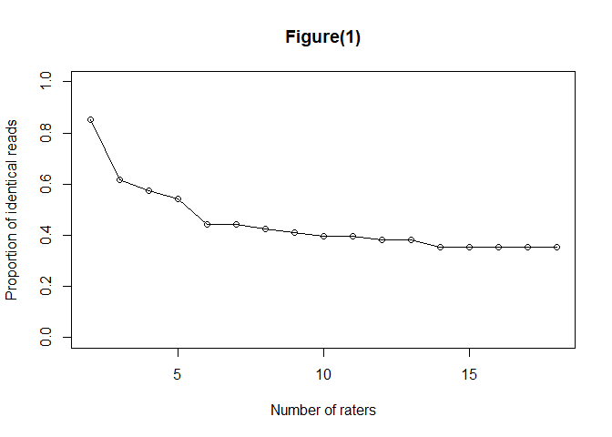
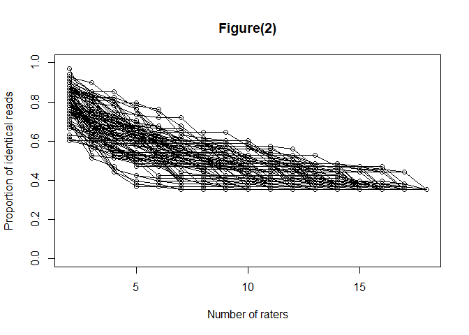
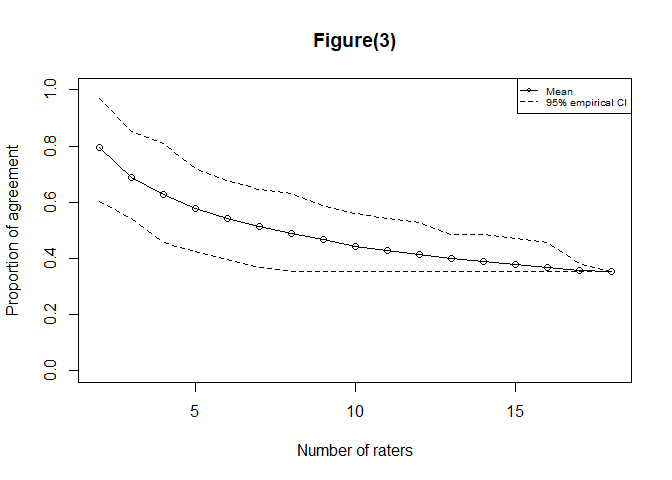
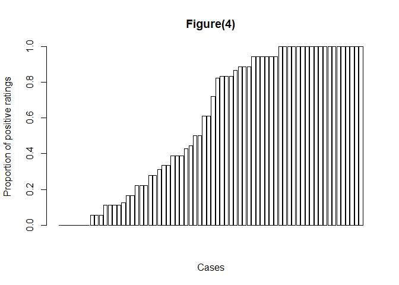
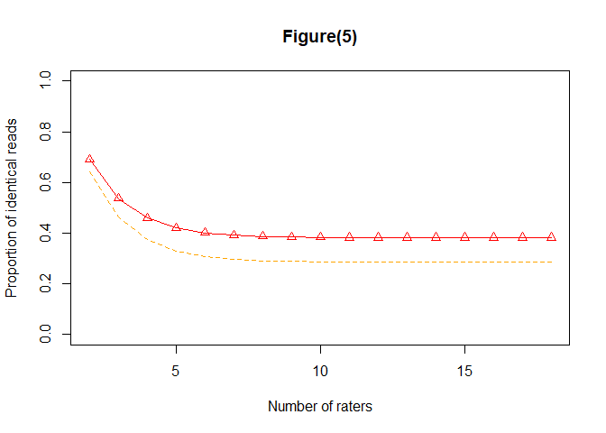
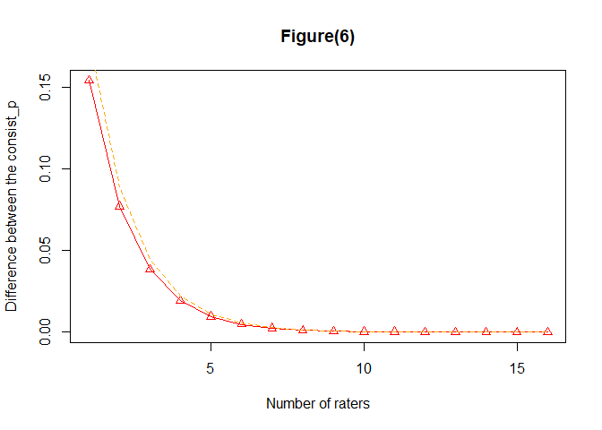

<!-- README.md is generated from README.Rmd. Please edit that file -->

# ONEST

The Observers Needed to Evaluate Subjective Tests software implements a
statistical method in Reisenbichler et al. (2020[1]), to determine the
minimum number of evaluators needed to estimate agreement involving a
large number of raters. This method could be utilized by regulatory
agencies, such as the FDA, when evaluating agreement levels of a newly
proposed subjective laboratory test. Input to the program should be
binary(1/0) pathology data, where “0” may stand for negative and “1” for
positive. The example datasets in this software are from Rimm et
al. (2017[2]) (the SP142 assay), and Reisenbichler et al. 2020. This
program can run in R version 3.5.0 and above.

## Installation

You can install ONEST from github with:

``` r
# install.packages("devtools")
devtools::install_github("hangangtrue/ONEST")
```

You can also install the released version of ONEST from
[CRAN](https://CRAN.R-project.org) with:

``` r
install.packages("ONEST")
```

## Example

This is a basic example which shows you how this software works:

``` r
library(ONEST)

# load in the sp142_bin dataset
data('sp142_bin')
ONEST_main(sp142_bin)
```

<!-- --><!-- --><!-- --><!-- --><!-- --><!-- -->

    #> $consistency
    #>       consist_p consist_low
    #>  [1,] 0.6911795   0.6427088
    #>  [2,] 0.5367693   0.4640632
    #>  [3,] 0.4595634   0.3747395
    #>  [4,] 0.4209597   0.3300768
    #>  [5,] 0.4016573   0.3077448
    #>  [6,] 0.3920057   0.2965783
    #>  [7,] 0.3871797   0.2909948
    #>  [8,] 0.3847665   0.2882029
    #>  [9,] 0.3835598   0.2868068
    #> [10,] 0.3829564   0.2861087
    #> [11,] 0.3826547   0.2857597
    #> [12,] 0.3825039   0.2855851
    #> [13,] 0.3824284   0.2854978
    #> [14,] 0.3823907   0.2854542
    #> [15,] 0.3823718   0.2854324
    #> [16,] 0.3823624   0.2854214
    #> [17,] 0.3823577   0.2854160
    #> 
    #> $difference
    #>        diff_consist    diff_high
    #>  [1,] -1.544102e-01 1.786456e-01
    #>  [2,] -7.720588e-02 8.932368e-02
    #>  [3,] -3.860371e-02 4.466273e-02
    #>  [4,] -1.930243e-02 2.233203e-02
    #>  [5,] -9.651598e-03 1.116646e-02
    #>  [6,] -4.826038e-03 5.583506e-03
    #>  [7,] -2.413163e-03 2.791919e-03
    #>  [8,] -1.206665e-03 1.396057e-03
    #>  [9,] -6.033806e-04 6.980838e-04
    #> [10,] -3.017172e-04 3.490731e-04
    #> [11,] -1.508736e-04 1.745539e-04
    #> [12,] -7.544503e-05 8.728646e-05
    #> [13,] -3.772701e-05 4.364843e-05
    #> [14,] -1.886594e-05 2.182703e-05
    #> [15,] -9.434279e-06 1.091503e-05
    #> [16,] -4.717841e-06 5.458327e-06
    #> 
    #> $estimates
    #>      size_case size_rater         p    p_plus   p_minus
    #> [1,]        68         18 0.4984245 0.2794118 0.1029412
    #> 
    #> $empirical
    #>       lower_bound      mean upper_bound
    #>  [1,]   0.6029412 0.7928382   0.9264706
    #>  [2,]   0.5294118 0.6938971   0.8529412
    #>  [3,]   0.4411765 0.6277941   0.8088235
    #>  [4,]   0.4117647 0.5815147   0.7352941
    #>  [5,]   0.3970588 0.5455735   0.6911765
    #>  [6,]   0.3823529 0.5155294   0.6470588
    #>  [7,]   0.3676471 0.4906471   0.6176471
    #>  [8,]   0.3676471 0.4701912   0.5882353
    #>  [9,]   0.3529412 0.4492500   0.5735294
    #> [10,]   0.3529412 0.4326765   0.5441176
    #> [11,]   0.3529412 0.4171176   0.5294118
    #> [12,]   0.3529412 0.4025882   0.5000000
    #> [13,]   0.3529412 0.3904706   0.4852941
    #> [14,]   0.3529412 0.3791176   0.4558824
    #> [15,]   0.3529412 0.3688971   0.4558824
    #> [16,]   0.3529412 0.3609559   0.4411765
    #> [17,]   0.3529412 0.3529412   0.3529412

Some more details and examples can be found in vignettes of the package.

[1] Reisenbichler, E. S., Han, G., Bellizzi, A., Bossuyt, V., Brock, J.,
Cole, K., Fadare, O., Hameed, O., Hanley, K., Harrison, B. T., Kuba, M.
G., Ly, A., Miller, D., Podoll, M., Roden, A. C., Singh, K., Sanders, M.
A., Wei, S., Wen, H., Pelekanou, V., Yaghoobi, V., Ahmed, F., Pusztai,
L., and Rimm, D. L. (2020) “Prospective multi-institutional evaluation
of pathologist assessment of PD-L1 assays for patient selection in
triple negative breast cancer,” Mod Pathol, DOI:
10.1038/s41379-020-0544-x; PMID: 32300181.

[2] Rimm, D. L., Han, G., Taube, J. M., Yi, E. S., Bridge, J. A.,
Flieder, D. B., Homer, R., West, W. W., Wu, H., Roden, A. C., Fujimoto,
J., Yu, H., Anders, R., Kowalewski, A., Rivard, C., Rehman, J.,
Batenchuk, C., Burns, V., Hirsch, F. R., and Wistuba,, II (2017) “A
Prospective, Multi-institutional, Pathologist-Based Assessment of 4
Immunohistochemistry Assays for PD-L1 Expression in Non-Small Cell Lung
Cancer,” JAMA Oncol, 3(8), 1051-1058, DOI: 10.1001/jamaoncol.2017.0013,
PMID: 28278348.
